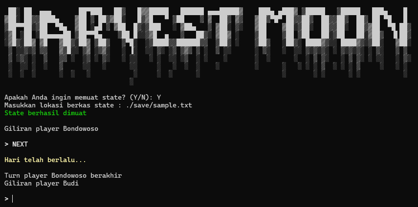

# IF2210_TB1_C0K
Repository Tugas Besar 1 Pemrograman Berorientasi Objek 2023/2024

## Deskripsi
Harvest Moon, merupakan sebuah gim berbasis Command Line Interface (CLI) yang dibangun menggunakan bahasa C++ dengan mengaplikasikan konsep pemrograman berbasis objek.



## Keperluan
1.  Linux / Windows Subsystem for Linux (WSL)
2.  G++ versi 11, 14 atau 17.
3.  CMake (min versi 3.22.1)
```
sudo apt install g++
sudo apt install cmake
```

## Cara Main
 
1. Clone repository
```
git clone https://github.com/rafimaliki/IF2210_TB1_C0K
```
2. Set directory terminal ke root project
```
cd IF2210_TB1_C0K
```
3. Build program
```
./build.sh
```
4. Run program
```
./bin/main
```
5. Cara muat savefile (opsional)
```
Masukkan lokasi berkas state : ./save/<namafile>.txt
```

## Kelompok
Debata Mangaramoti (C0K) :
1. 13522129 / Hugo Sabam Augusto
2. 13522136 / Muhammad Zaki
3. 13522137 / Ahmad Rafi Maliki
4. 13522144 / Nicholas Reymond Sihite
5. 13522149 / Muhammad Dzaki Arta

